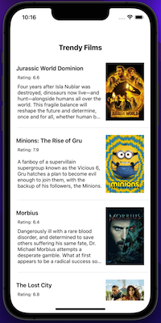
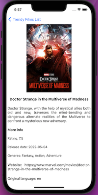

#  TrendyFilms

<h4 align="center">A iOS app to search a film to watch</h4>

  •<a href="#key-features">Key Features</a>
  •<a href="#how-to-use">How To Use</a> 

## Code Quality Status
 
 
 
 
  

## Key Features

* UIKit
* MVVM
* Structs
* Classes
* Optionals
* Extensions
* Closures
* APIs
* JSON Parsing
* Error handling
* TableView search
* RxSwift
* RxCocoa

## How To Use
The app help you to choose a film to watch. It uses The Movie Data Base API (https://www.themoviedb.org) to display current popular films and its most important info. Simply scroll down and select a film to read more info.